# 🍷 Aldeanos Club — Architecture & SaaS Ecosystem Showcase

> **Caso de Estudio de Arquitectura, Integración Webhook y Sistema Distribuido Multi-Tenant.**  
> *Este repositorio documenta el diseño, la arquitectura cloud, la seguridad RBAC y los contratos de API para la plataforma SaaS de fidelización "Aldeanos Club". El código fuente privado del cliente se mantiene bajo acuerdo de confidencialidad.*

---

## 📸 Resumen Ejecutivo & Tour Visual del Sistema

**Aldeanos Club** es una plataforma SaaS distribuida diseñada para automatizar la gestión de clubes de fidelización de vinos y beneficios comerciales.

El sistema reemplaza procesos manuales (planillas de cálculo y carnets físicos) por una **arquitectura desacoplada de alta velocidad** que automatiza el alta de socios desde e-commerce, valida credenciales vía QR en tiempo real, bloquea consumos duplicados por fraude y audita métricas de uso por comercio.

---

### 1. Autenticación & Credencial Digital de Socio

| Formulario de Autenticación (RBAC) | Tarjeta Digital Web del Socio | Email Transaccional Automatizado |
| :---: | :---: | :---: |
| 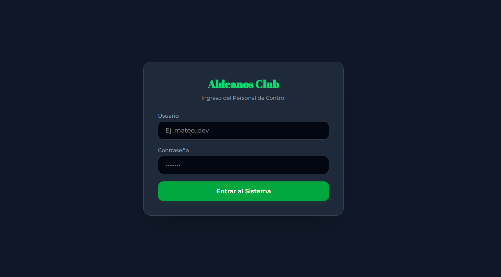 | 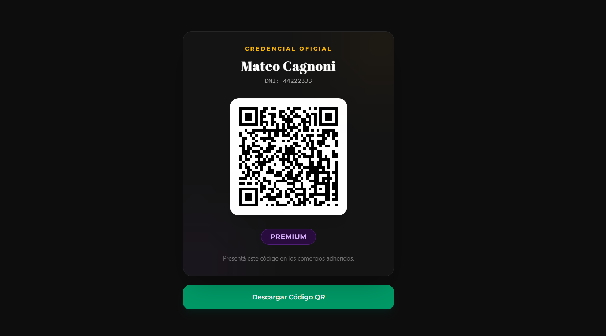 |  |

---

### 2. Panel de Administración Central (SUPERADMIN)

| Panel Principal de Gestión de Socios | Formulario de Alta Manual de Socio |
| :---: | :---: |
| 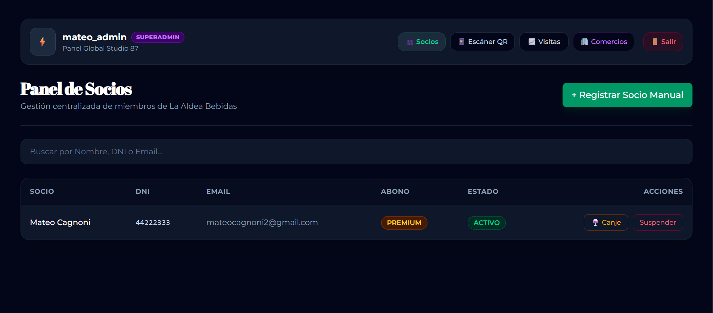 | 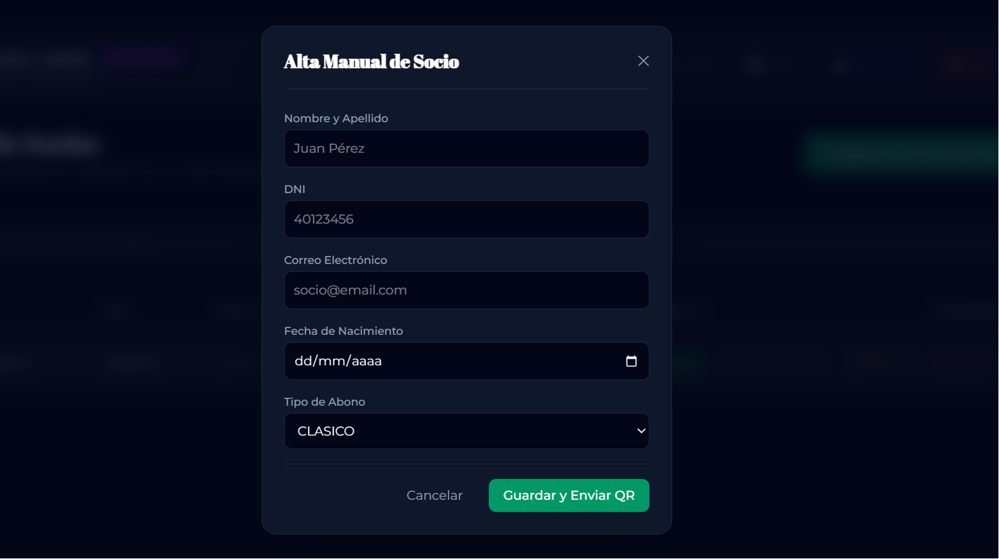 |

| Red de Comercios Adheridos | Alta de Nuevo Comercio Adherido |
| :---: | :---: |
| 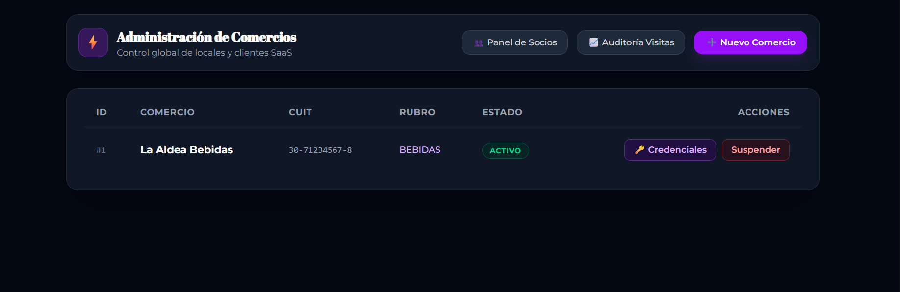 | 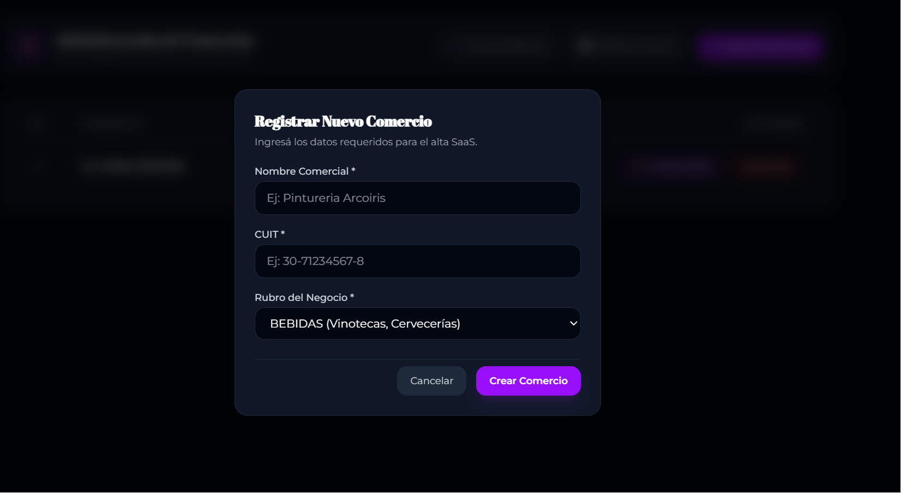 |

> **Gestión de Accesos a Comercios:** El SUPERADMIN puede generar y asignar credenciales independientes a cada comercio adherido con rol restringido `RECEPCION` (`./docs/images/credenciales-comercio.png`).

---

### 3. Motor Operativo de Escaneo QR & Reglas de Negocio

El módulo de punto de venta evalúa en tiempo real el estado financiero del socio y la disponibilidad de sus beneficios:

| Caso 1: Socio Activo (Acceso Autorizado) | Caso 2: Socio Suspendido (Bloqueado por Mora) |
| :---: | :---: |
| 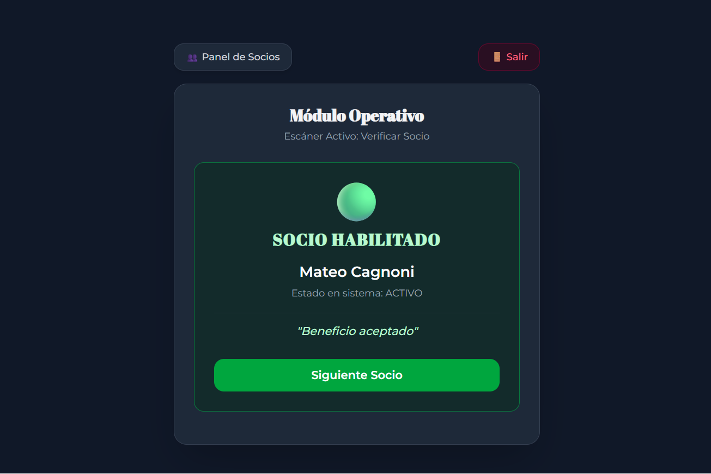 | 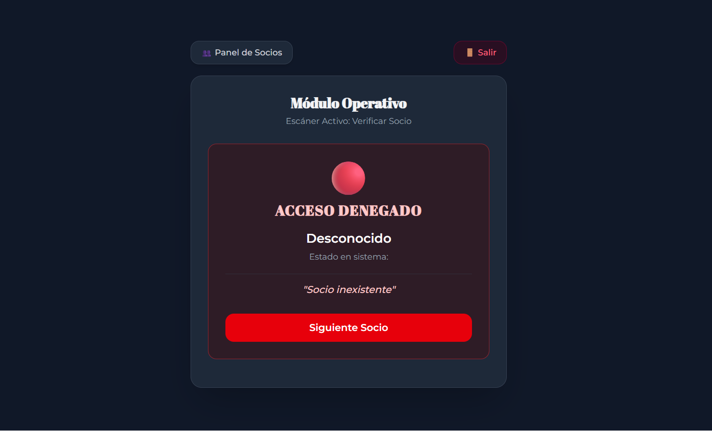 |
| *Valida cuota al día e impacta la visita.* | *Rechaza el descuento si supera los 45 días de mora.* |

| Caso 3: Canje de Vino Autorizado | Caso 4: Doble Canje Bloqueado (Guarda Anti-Fraude) |
| :---: | :---: |
| 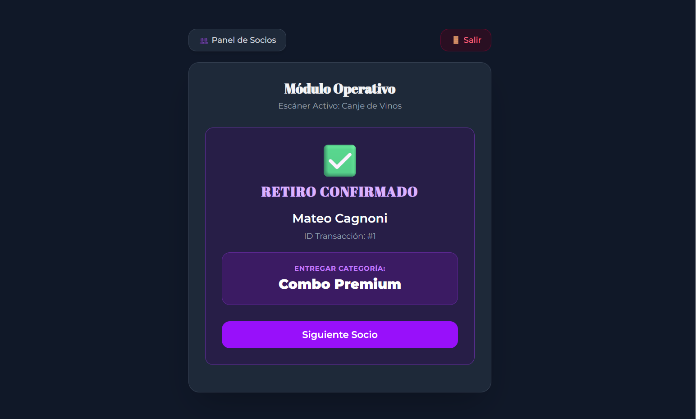 | 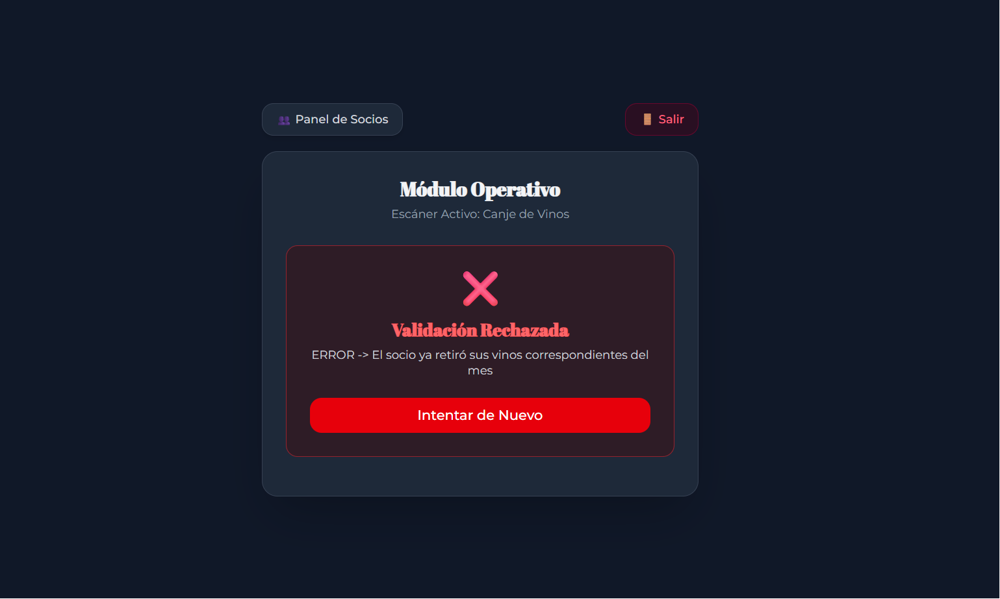 |
| *Entrega y registra el beneficio del mes.* | *Bloquea un segundo intento dentro del mismo periodo.* |

---

### 4. Módulo de Auditoría de Visitas & Métricas Comerciales

| Dashboard de Métricas y Trazabilidad de Visitas en Tiempo Real |
| :---: |
| 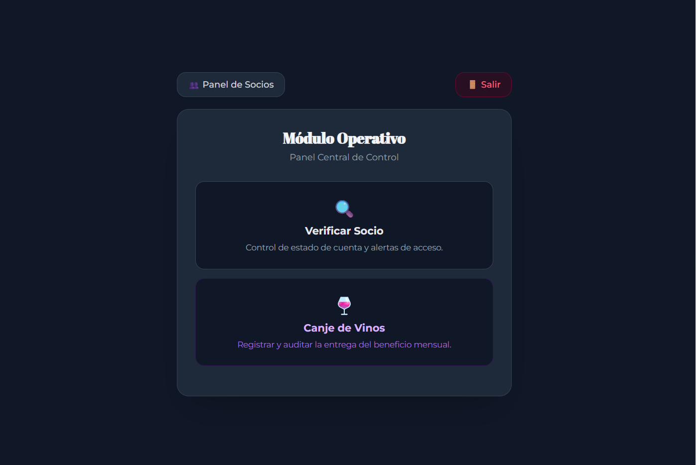 |
| *Permite filtrar consumos por local, fecha y socio para análisis de retención y métricas de negocio.* |

---

## 🎯 Problema Operativo vs. Solución de Software

### El Problema de Negocio
El cliente operaba un club de fidelización con tres niveles de abono (**Clásico, Premium, Luxury**). La operativa manual presentaba graves cuellos de botella:
* Imposibilidad de validar en tiempo real si la cuota de un socio estaba al día al momento de presentarse en un comercio asociado.
* Pérdidas económicas por falta de control sobre la entrega de beneficios mensuales (ej. retiro doble del beneficio de vinos).
* Carga operativa excesiva en la emisión de credenciales impresas y control en planillas de Excel.

### La Solución de Arquitectura
Se desarrolló un ecosistema totalmente automatizado y desacoplado:
1. **Captación & Billing (WordPress + WooCommerce)**: Maneja la venta comercial y cobros recurrentes de suscripciones.
2. **Webhook Integration (PHP Event Listener)**: Intercepta pedidos completados y sincroniza datos en tiempo real hacia la API REST.
3. **Core API (Java 21 / Spring Boot 3)**: Motor transaccional con reglas de negocio (suspensión automática a 45 días, control de stock de vinos y auditoría de visitas).
4. **App Web Operativa (Next.js / TypeScript)**: Panel multi-rol para gestión administrativa, escáner de QR desde cámara web/mobile y analítica.

---

## 🔐 Modelo de Seguridad & Control de Acceso (RBAC)

La aplicación implementa **Spring Security + JWT** restringiendo funciones según tres roles jerárquicos:

| Rol | Permisos & Alcance Técnico |
| :--- | :--- |
| **`SUPERADMIN`** *(Studio 87 / Mateo)* | Control global. Alta/suspensión manual de socios, gestión de comercios adheridos, generación de credenciales, auditoría global de visitas y override de canjes de vino. |
| **`ALDEA_ADMIN`** *(Comercio Emisor - La Aldea)* | Visualización de nómina de socios, alta directa de clientes en mostrador, escáner dual (validación de cuota + entrega del beneficio mensual de vino con bloqueo anti-fraude). |
| **`RECEPCION`** *(Comercio Adherido)* | Vista reducida exclusiva de escaneo QR. Permite verificar estado activo/suspendido antes de aplicar descuentos e impacta la visita en la base de datos centralizada. |

---

## 🔄 Flujo de Integración E-Commerce ➔ Backend Java

Cuando un cliente adquiere su suscripción en la web institucional, un snippet personalizado ejecuta un Webhook seguro hacia el backend en Spring Boot:

```mermaid
sequenceDiagram
    autonumber
    actor Cliente
    participant WP as WordPress / WooCommerce
    participant API as Spring Boot 3 API
    participant DB as PostgreSQL 16
    participant Mail as Servicio SMTP Mailer

    Cliente->>WP: Completa Pago de Abono (Clásico/Premium/Luxury)
    WP->>WP: Hook: woocommerce_order_status_completed
    WP->>API: POST /api/socios (Headers: X-Studio87-API-Key)
    Note over API: Valida API Key, DNI y Mapea Abono
    API->>DB: Guarda Socio (Estado: ACTIVO, UUID/QR Generado)
    API->>Mail: Genera y Envía Email Transaccional con QR
    Mail-->>Cliente: Recibe Email con Credencial Web y Descargar QR HD
    API-->>WP: HTTP 201 Created (Marca meta _api_registrado = yes)
